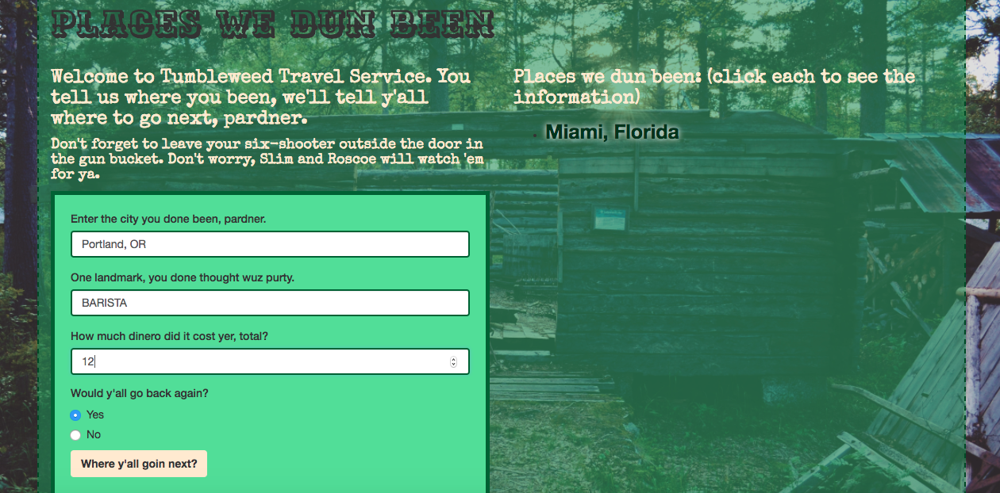

# _"Places We've Done Been" Project Week 4_

#### _Places We've Been project, August 19th 2016_

#### By _**Kyle Lange and Amber Farrington**_

## Description

_This project will have the user enter a place they've been, two landmarks they encountered there, what their travel expenses were total, and to tell if they would visit again YES or NO_

#### See it live [HERE](https://kylelange.github.io/places-objects/).
_

## Description

## Setup/Installation Requirements

1. Download this repo using your terminal: git clone repo-name pasted here

2. View the code by drag-and-dropping the file into your [favorite text editor](https://atom.io)

3. run/check-out the program by dropping the index/html file from your folder into your web browser

## Known Bugs

_There are no known bugs as of the last commit. Please send an ISSUE on github in the repository if you see something I have not._

## Support and contact details

For questions, concerns, or suggestions please email baronsintrees@gmail.com

## Technologies Used

* HTML5
* CSS3
* JavaScript with jQuery 3.1

### License

*This software is licensed under the MIT license.*

Copyright (c) 2016 **_Kyle Lange & Amber Farrington_**
